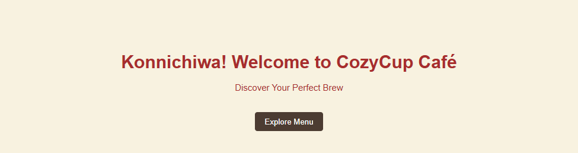
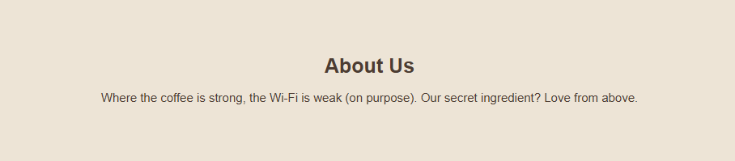
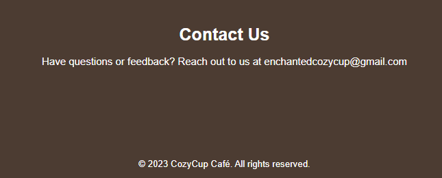

<<<<<<< HEAD
# Testing branch for study purposes

=======

# Project Description
 a simple landing page for cafe cozycup

## Features
- AI-powered Joke Barista
- Order placement and Checkout
- Personalized Menu Suggestions

## Screen Captures
*catchy hero text*

*sample funny Menu*

*A funny history of the cafe*

*contact information of the cafe*

>>>>>>> f8a245ac41f0571aa63b87027008a6261dfa4eab
# About the Authors

<<<<<<< HEAD

    
    
<b>Ross Ivan T. Venturillo</b> 
    <i>202380388@psu.palawan.edu.ph</i>

    

        
        
    

=======
 &nbsp; &nbsp; &nbsp;  

**Names: Ross Ivan T. Venturillo & Dianara Kristy D. Garciano**  **Email: 202380388@psu.palawan.edu.ph & 202380249@psu.palawan.edu.ph**

**Ross Ivan T. Venturillo**

  

**Dianara Kristy D. Garciano**   

  

>>>>>>> f8a245ac41f0571aa63b87027008a6261dfa4eab

    
    
<b>Dianara Kristy D. Garciano</b> 
    <i>202380249@psu.palawan.edu.ph</i>

    

        
        
    

